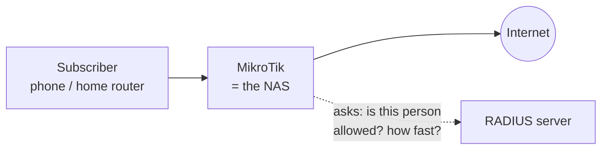
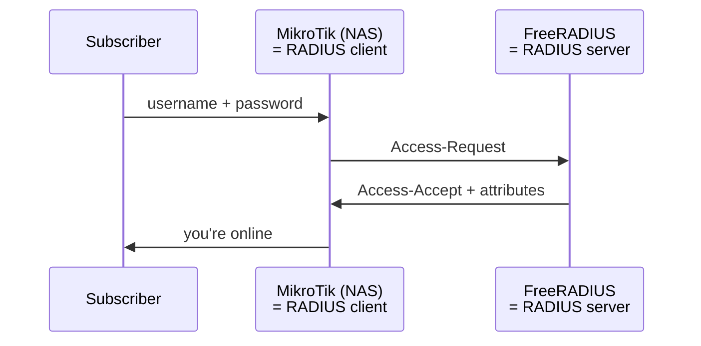
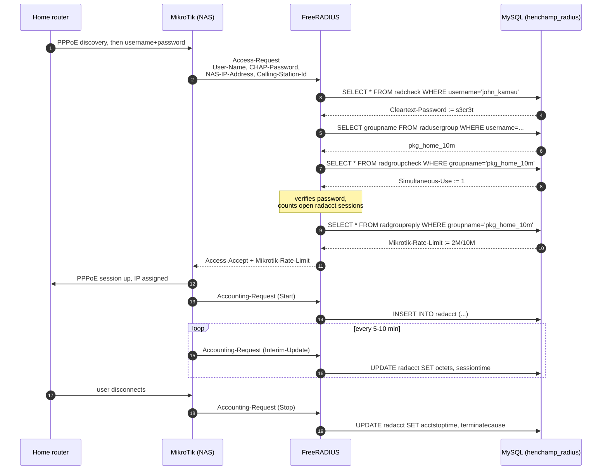
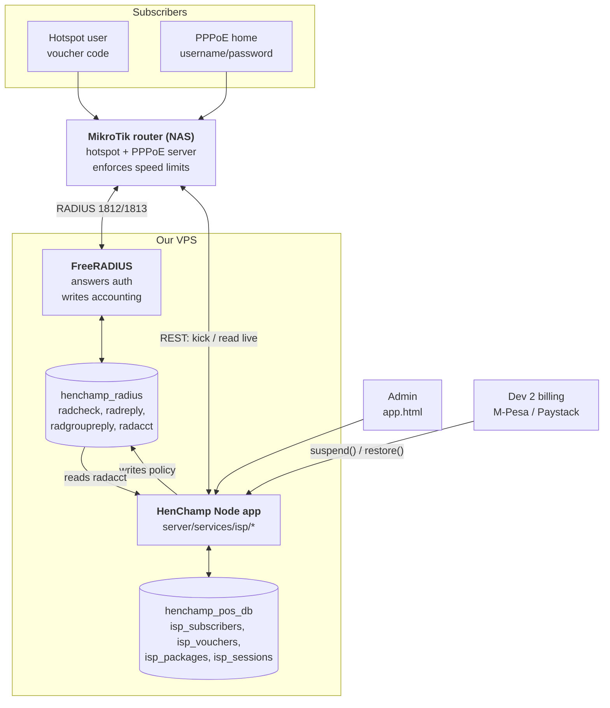

# Understanding the HenChamp ISP System — A Guide for Kusal

**Purpose:** teach you the domain before you build it. Read this once end-to-end, then use [ISP_PLAN.md](ISP_PLAN.md) as your build order.

You already know Node, Express and MySQL. What's new here is **networking domain knowledge**: how an ISP actually controls who gets internet, how fast, for how long, and how it cuts them off when they don't pay. That's what this document covers.

---

## Table of contents

1. [What are we actually building?](#1-what-are-we-actually-building)
2. [The two ways HenChamp sells internet](#2-the-two-ways-henchamp-sells-internet)
3. [The NAS — the thing that actually controls the traffic](#3-the-nas--the-thing-that-actually-controls-the-traffic)
4. [AAA and RADIUS](#4-aaa-and-radius)
5. [How FreeRADIUS stores everything in SQL](#5-how-freeradius-stores-everything-in-sql)
6. [A login, packet by packet](#6-a-login-packet-by-packet)
7. [Accounting — where usage data comes from](#7-accounting--where-usage-data-comes-from)
8. [Cutting someone off](#8-cutting-someone-off)
9. [Bandwidth control](#9-bandwidth-control)
10. [Vouchers and the single-device problem](#10-vouchers-and-the-single-device-problem)
11. [Where our Node app fits](#11-where-our-node-app-fits)
12. [The five bugs you are most likely to write](#12-the-five-bugs-you-are-most-likely-to-write)
13. [Your lab: build it yourself in an evening](#13-your-lab-build-it-yourself-in-an-evening)
14. [Glossary](#14-glossary)

---

## 1. What are we actually building?

HenChamp is a Kenyan business starting a small ISP — about **100–150 subscribers** to begin with. Two kinds of customer:

- Someone walks up to a shop, pays KES 50, gets a **code**, types it into a Wi-Fi login page, and browses for an hour. That's **hotspot**.
- A household pays a **monthly** fee and gets a permanent connection to their house. That's **PPPoE**.

Your job (Section A) is the machinery that makes both work: creating accounts, letting people log in, controlling their speed, measuring their usage, and cutting them off.

Dev 2 handles *money* (M-Pesa, Paystack, recurring billing). Dev 3 handles the *shop* (storefront, invoices). But here's the thing that makes your section the interesting one:

> **When Dev 2's code decides someone hasn't paid, your code is what actually stops their internet.**

A database column saying `status = 'suspended'` doesn't stop anybody from watching YouTube. Something has to reach out to real network equipment and enforce it. That's you.

---

## 2. The two ways HenChamp sells internet

### Hotspot (captive portal)

You've used this in an airport or hotel. You connect to open Wi-Fi, try to load any website, and get redirected to a login page instead.

How the redirect works: the router lets your device connect and get an IP, but marks you "unauthenticated" and **intercepts your HTTP traffic**, answering with a redirect to its own login page. Once you log in successfully, the router adds your MAC address to its allowed list and stops intercepting.

- **Identity = a voucher code** you bought
- **Typically short-lived** — an hour, a day, a week
- **Per-device** — you log in from the phone in your hand

### PPPoE (Point-to-Point Protocol over Ethernet)

This is how fixed home internet is usually delivered. The customer's home router is configured with a username and password. When it powers on, it *dials* the ISP — builds a tunnel to the ISP's router, authenticates, and gets an IP address.

- **Identity = a username/password** stored in the home router
- **Long-lived** — a monthly subscription
- **Per-household** — everyone in the house shares one PPPoE session

### Why an ISP uses PPPoE at all

A fair question: why not just give the house an IP address and be done?

Because PPPoE gives you a **session**. There's a definite moment the customer connects and a definite moment they disconnect. That means you can:

- authenticate them (so a neighbour can't just plug into your cable)
- count exactly what they used
- **hang up on them** when they don't pay

Without a session there's no login, no accounting record, and nothing to disconnect. PPPoE exists mostly so ISPs can bill people. Which is exactly why it's in your section.

---

## 3. The NAS — the thing that actually controls the traffic

**NAS** = **Network Access Server**. Confusingly, nothing to do with the Network Attached Storage in your house. In RADIUS-speak, the NAS is *the device that sits between the subscriber and the internet and decides whether their packets go through.*

For HenChamp, the NAS is **the MikroTik router**.



This is the single most important thing to internalise:

> **Your Node app is not in the traffic path.** It cannot block anybody by itself. It can only tell the NAS what to do — or write down rules the NAS will look up later.

If your app crashes at 3am, subscribers who are already online stay online. That's a *good* property, and it's why we use RADIUS instead of having the app authenticate people directly.

### Why MikroTik?

Because it's what small ISPs across Africa and Asia actually run. Cheap (a usable router is $60–200), one OS (RouterOS) with hotspot, PPPoE, firewall, bandwidth shaping and a RADIUS client all built in, and a scriptable API.

The client doesn't own one yet — that's requirement A4. **You don't need to wait for him.** MikroTik ships **CHR (Cloud Hosted Router)**: the identical RouterOS as a virtual machine, free forever at 1 Mbps per interface. That's enough to build and test everything.

---

## 4. AAA and RADIUS

### The three A's

| | Question it answers | Example |
|---|---|---|
| **Authentication** | Who are you? | voucher `HC7K2M` with the right password |
| **Authorization** | What are you allowed? | 10 Mbps down, 2 GB cap, expires in 24h |
| **Accounting** | What did you use? | online 47 min, 312 MB down, 28 MB up |

**RADIUS** (Remote Authentication Dial-In User Service) is the protocol that carries all three. It's from 1991, designed for dial-up modems, and it is still exactly how ISPs do this in 2026. It's UDP, and its ports are worth memorising:

| Port | Purpose |
|---|---|
| **1812/udp** | Authentication (Access-Request / Accept / Reject) |
| **1813/udp** | Accounting (Accounting-Request: Start / Interim / Stop) |
| **3799/udp** | CoA & Disconnect — RFC standard |
| **1700/udp** | CoA & Disconnect — **MikroTik's actual default** ⚠️ |

That last row is a real trap. MikroTik doesn't follow the RFC default. Set it explicitly on both sides.

### The shared secret

The NAS and the RADIUS server share a password — the **shared secret**. It's not encryption in any modern sense; it's a 1991-era MD5-based scheme that authenticates the packets and lightly obscures the password field. Treat RADIUS traffic as **effectively plaintext**: keep it on a private network or inside a VPN, never across the open internet.

### The client/server relationship is inverted from what you expect

The **router is the client**. The RADIUS server is the server. The subscriber's phone never speaks RADIUS at all — it talks to the router (via a web form or PPPoE), and the *router* translates that into RADIUS on the subscriber's behalf.



### Attributes

A RADIUS packet is a list of **attributes** — key/value pairs. Standard ones are numbered by the IETF (`User-Name` = 1, `NAS-IP-Address` = 4, `Calling-Station-Id` = 31...).

Vendors add their own via **Vendor-Specific Attributes (VSAs)**. MikroTik's vendor ID is **14988**, and these are the ones you'll use:

| Attribute | ID | Type | What it does |
|---|---|---|---|
| `Mikrotik-Recv-Limit` | 1 | uint32 | download cap in bytes |
| `Mikrotik-Xmit-Limit` | 2 | uint32 | upload cap in bytes |
| `Mikrotik-Group` | 3 | string | which router profile to apply |
| `Mikrotik-Rate-Limit` | **8** | string | **speed limit — your main tool** |
| `Mikrotik-Recv-Limit-Gigawords` | 14 | uint32 | high 32 bits of attr 1 |
| `Mikrotik-Xmit-Limit-Gigawords` | 15 | uint32 | high 32 bits of attr 2 |
| `Mikrotik-Total-Limit` | **17** | uint32 | **combined data cap in bytes** |
| `Mikrotik-Total-Limit-Gigawords` | 18 | uint32 | high 32 bits of attr 17 |
| `Mikrotik-Address-List` | 19 | string | put user in a firewall address list |

To make FreeRADIUS understand these names you load MikroTik's **dictionary** file — a plain text map from names to numbers.

---

## 5. How FreeRADIUS stores everything in SQL

FreeRADIUS can read users from flat files, LDAP, or SQL. We use SQL (`rlm_sql`) because that's what lets our Node app manage subscribers by writing rows.

There are seven tables. Learn these and you understand 80% of the system.

| Table | Holds |
|---|---|
| `radcheck` | per-user **conditions to check** (password, allowed MAC) |
| `radreply` | per-user **settings to send back** on success |
| `radgroupcheck` | conditions for everyone in a group |
| `radgroupreply` | settings for everyone in a group |
| `radusergroup` | which user is in which group |
| `radacct` | **usage records** — one row per session |
| `nas` | the routers allowed to talk to us, and their shared secrets |

### check vs reply — the distinction that matters

- **check** = a *requirement*. "Your password must be X." "Your MAC must be Y." Fail one → Access-Reject.
- **reply** = a *setting*. "Here's your speed limit." "Here's your session timeout." Sent only after all checks pass.

### The `op` column

Every row has an operator. The three you need:

| `op` | Where | Meaning |
|---|---|---|
| `:=` | check or reply | **set** this value, replacing anything already there |
| `==` | check | **must equal** — a comparison that can fail |
| `+=` | reply | **add** to the list, don't replace |

The classic beginner bug: using `==` for a password in `radcheck` when you meant `:=`. Or using `:=` for a MAC check, which *assigns* instead of *verifying* and silently lets everyone in.

### Groups are how packages work

Rather than writing a speed limit onto all 150 subscribers, you write it once on a **group** and put subscribers in it:

```sql
-- Package: "Home 10 Mbps" -> one group
INSERT INTO radgroupreply (groupname, attribute, op, value)
VALUES ('pkg_home_10m', 'Mikrotik-Rate-Limit', ':=', '2M/10M');

INSERT INTO radgroupcheck (groupname, attribute, op, value)
VALUES ('pkg_home_10m', 'Simultaneous-Use', ':=', '1');

-- Subscriber joins the group
INSERT INTO radusergroup (username, groupname, priority)
VALUES ('john_kamau', 'pkg_home_10m', 1);

-- Subscriber's own password
INSERT INTO radcheck (username, attribute, op, value)
VALUES ('john_kamau', 'Cleartext-Password', ':=', 's3cr3t');
```

Change the package price or speed → update **one row**. That's why `isp_packages.radius_group` exists in our schema.

### ⚠️ Why the password is in cleartext

`Cleartext-Password` looks like a beginner mistake. It isn't — it's forced by the protocol.

With **CHAP** or **MS-CHAP** the client never sends the password. It sends `hash(challenge + password)`. For the server to verify that, it must compute the same hash — which means it must **have the original password**. A bcrypt hash is useless here; you can't un-bcrypt it to feed into MD5.

So your options are:

1. Force **PAP** only (password sent in the packet, protected only by the weak shared-secret scheme) and store a bcrypt hash.
2. Store cleartext and protect the database.

Everyone in this industry picks 2. Our mitigation, in [ISP_PLAN.md §2.3](ISP_PLAN.md#23-️-radius-needs-the-password-in-cleartext--plan-for-it): keep the encrypted copy in *our* table, lock down the RADIUS DB user, and **auto-generate random secrets** so a subscriber never picks a password they've reused on their email.

---

## 6. A login, packet by packet

A subscriber called `john_kamau` powers on their home router. Follow every step.



Read that diagram until it's boring. Almost every bug you'll hit is "one of these steps didn't happen", and knowing the sequence tells you where to look:

- Nothing in FreeRADIUS logs → the NAS isn't reaching it (firewall, or missing `nas` row)
- Access-Reject → password or a check attribute
- Accept but no internet → the router side (routing/NAT), not RADIUS
- Online but no `radacct` rows → accounting isn't configured on the NAS
- Usage figures frozen → interim updates aren't enabled

---

## 7. Accounting — where usage data comes from

Requirement A6 says "usage/data tracking". You don't measure anything yourself — **the router counts, and reports.**

Three message types on port 1813:

| Type | When | Carries |
|---|---|---|
| **Start** | session begins | username, IP, MAC, NAS, session ID |
| **Interim-Update** | every N minutes | bytes and seconds so far |
| **Stop** | session ends | final totals + why it ended |

These become rows in `radacct`. The columns you'll care about:

| Column | Meaning |
|---|---|
| `acctuniqueid` | unique session key — **join on this, not `acctsessionid`** |
| `username` | who |
| `acctstarttime` / `acctstoptime` | `acctstoptime IS NULL` ⇒ **still online** |
| `acctsessiontime` | seconds |
| `acctinputoctets` | bytes **from** the subscriber = their upload |
| `acctoutputoctets` | bytes **to** the subscriber = their download |
| `callingstationid` | the subscriber's **MAC address** ← this is what voucher binding uses |
| `framedipaddress` | the IP they were given |
| `acctterminatecause` | `User-Request`, `Idle-Timeout`, `NAS-Reboot`... |

**Input/output are named from the router's point of view.** `acctinputoctets` is traffic the router *received*, i.e. the customer's upload. Getting this backwards makes your dashboard show every customer uploading 10× more than they download, which is the tell that you flipped it.

### ⚠️ The 4 GiB bug — the most important paragraph in this document

`Acct-Input-Octets` is a **32-bit** integer. It wraps at 4,294,967,295 bytes ≈ 4 GiB.

RADIUS's fix is a companion attribute holding the high-order bits:

```
real_bytes = (Acct-Input-Gigawords × 4294967296) + Acct-Input-Octets
```

FreeRADIUS's stock SQL already folds these together into `radacct.acctinputoctets` (a `bigint`). **But the moment you write your own accounting reader, or set a data cap above 4 GiB, you must handle gigawords yourself.**

Skip it and a customer on a 20 GB plan burns through 20 GB, your dashboard reads 1.2 GB, and they're never capped. It won't show up in testing because nobody moves 4 GiB during a test. **Write the unit test with a >4 GiB number.**

---

## 8. Cutting someone off

Dev 2's code decides "no payment, suspend". Now what?

**Two things must happen, and beginners only do the first.**

### Layer 1 — stop future logins

Change the policy in SQL. Move them to a `suspended` group, or:

```sql
INSERT INTO radcheck (username, attribute, op, value)
VALUES ('john_kamau', 'Auth-Type', ':=', 'Reject');
```

Next time they authenticate, they're refused.

### Layer 2 — kick the session that's already up

Layer 1 does **nothing** to a subscriber who is online right now. A PPPoE session can stay up for weeks. Your SQL change won't be consulted again until they reconnect.

So you must actively terminate the live session. Two ways:

**(a) Tell the router directly** — RouterOS REST API. What we're doing in v1:

```bash
# list live PPPoE sessions
curl -k -u admin:pass https://192.168.88.1/rest/ppp/active

# kick one
curl -k -u admin:pass -X POST https://192.168.88.1/rest/ppp/active/remove \
     -H 'content-type: application/json' --data '{".id":"*3"}'
```

Easy from Node — native `fetch`, zero dependencies.

**(b) RADIUS Disconnect-Request (CoA)** — RFC 5176. The RADIUS server sends an *unsolicited* packet to the NAS saying "terminate this session". This inverts the usual direction: normally the NAS asks the server, here the server tells the NAS. It's the "proper" way and it scales to many routers, but it needs a RADIUS packet library and careful port/firewall setup. **v2.**

Related: a **CoA-Request** *changes* a live session instead of ending it — e.g. drop someone to 128 kbps when they blow their data cap, without disconnecting them. That's how "fair usage policy" throttling works.

### Restoring

Reverse both layers: delete the reject rule, put them back in their package group. They can reconnect immediately — or their router will retry on its own within seconds.

**Restore must be idempotent.** M-Pesa retries webhooks. You will get "payment confirmed" two or three times for one payment. Calling `restoreSubscriber()` three times must equal calling it once — no double-extended billing cycles.

---

## 9. Bandwidth control

Requirement A6, and this one's pleasantly simple: send an attribute, the router does the work.

```sql
INSERT INTO radgroupreply (groupname, attribute, op, value)
VALUES ('pkg_home_10m', 'Mikrotik-Rate-Limit', ':=', '2M/10M');
```

Format:

```
rx-rate[/tx-rate] [rx-burst-rate/tx-burst-rate] [rx-burst-threshold/tx-burst-threshold] [rx-burst-time/tx-burst-time]
```

- `k` = kilobits, `M` = megabits
- **`rx` = what the router receives = the subscriber's UPLOAD**
- **`tx` = what the router transmits = the subscriber's DOWNLOAD**

So `2M/10M` = 2 Mbps up, 10 Mbps down.

⚠️ **Verify this on the actual router before you ship.** The naming is from the router's perspective and it's easy to talk yourself into the opposite. If you get it backwards, every customer on a "10 Mbps down" plan gets 10 up / 2 down and the support calls start immediately. Set it, run a speed test, look at the numbers. Five minutes now, saves a week later.

**Bursting** lets someone briefly exceed their rate — page loads feel snappy while sustained downloads stay capped. `2M/10M 4M/20M 2M/10M 8/8` means "burst to 20 Mbps down for 8 seconds".

`Mikrotik-Rate-Limit` takes precedence over every other way of setting speed on the router — so RADIUS wins over any local queue config. Good: our database is the single source of truth.

---

## 10. Vouchers and the single-device problem

Requirement **A5** is the one the client was most explicit about:

> *"Client explicitly does not want a subscription-style shared voucher — each voucher/code must lock to one device and not be reshareable."*

His worry is real: one person buys a KES 50 day pass, shares the code with eight friends, and he sells one voucher instead of nine.

### How binding works

The router already tells you the subscriber's MAC address in every RADIUS packet — the `Calling-Station-Id` attribute. So:

1. Voucher is created `unused`, with no MAC.
2. First successful login: capture `Calling-Station-Id`, store it as `bound_mac`, and write a check rule:
   ```sql
   INSERT INTO radcheck (username, attribute, op, value)
   VALUES ('HC7K2M', 'Calling-Station-Id', '==', 'A4:83:E7:11:22:33');
   ```
3. Every later login: FreeRADIUS compares the incoming MAC to that value. Different device → **Access-Reject**.

Add `Simultaneous-Use := 1` so the same code can't run two sessions at once even from one device.

Note `==` not `:=`. `==` *verifies*. `:=` would *assign* — silently letting everybody in. This exact typo is the most common way this feature ships broken.

### ⚠️ Be honest with the client about the limits

You are going to be asked "is it secure?" Two things must be said out loud, and written into the handover:

**1. MAC addresses are trivially spoofable.** Any laptop can change its MAC in one command. This stops casual code-sharing between friends — which is 95% of the actual loss — but it is not a cryptographic guarantee. Nobody's implementation is. Don't oversell it.

**2. Modern phones randomise their MAC.** iOS calls it "Private Wi-Fi Address"; Android calls it "Randomized MAC". The address is *usually stable for a given SSID*, so binding works fine day-to-day. But if the user toggles the setting, or forgets and rejoins the network, they may get a **new MAC and be locked out of the voucher they paid for**.

That's why the plan includes an admin **"reset binding"** button, and why the client's counter staff need to know it exists. A feature that locks paying customers out of their own purchase is worse than the sharing it prevents — unless there's a ten-second fix at the counter.

### Generating codes

Small details that matter because humans read these off paper and type them:

- **Never** `Math.random()`. Use `crypto.randomBytes`.
- Drop ambiguous characters: **no `0`/`O`, no `1`/`I`/`l`**.
- 8 characters from a 30-character alphabet ≈ 6.5×10¹¹ combinations — fine, but still rate-limit login attempts on the portal.
- Enforce uniqueness in the DB and retry on collision; don't trust randomness alone.

---

## 11. Where our Node app fits

Now the whole picture:



Your app has exactly **four** jobs:

1. **Own subscriber and voucher data** in `henchamp_pos_db` (the business view)
2. **Project that into RADIUS policy rows** in `henchamp_radius` (the network view)
3. **Read accounting back** out of `radacct` and roll it into usage reports
4. **Issue imperative commands** to the router when something must happen *now* (kick a session)

That's it. It never authenticates anyone, never touches a packet, and is never in the traffic path.

---

## 12. The five bugs you are most likely to write

Ranked by how likely they are and how long they'll take to find.

**1. Usage stops at 4 GB.** You didn't handle gigawords. Invisible in testing. → §7

**2. Upload and download are swapped.** Either you read `acctinputoctets` as download, or you wrote `Mikrotik-Rate-Limit` as `down/up`. → §7, §9

**3. Suspend "works" but the customer stays online.** You changed the DB and never kicked the live session. Reported as "suspend doesn't work sometimes" — it works for offline users, not online ones. → §8

**4. Zombie sessions lock people out.** Router rebooted, `Acct-Stop` never arrived, the `radacct` row stays open forever, and `Simultaneous-Use := 1` now blocks the real user from their own account. Needs a reaper job. → [ISP_PLAN.md §5.4](ISP_PLAN.md#54-️-zombie-sessions-will-bite)

**5. `:=` where you meant `==` on the MAC check.** Instead of verifying the device, you assign it. Every login "succeeds" and A5 is silently a no-op. → §10

Bonus, sitting in the repo right now: **[`server/config/database.js:18`](../server/config/database.js#L18) is pinned to `+05:30` (Sri Lanka).** The client is in Kenya (**UTC+3**). Every billing boundary and voucher expiry is 2.5 hours off. Fix it before Phase 2.

---

## 13. Your lab: build it yourself in an evening

Do this **before writing any Node code**. If you can't do it by hand, you can't automate it — and you'll waste days debugging your service when the problem is the router config.

### Setup

1. Install KVM/virt-manager (or VirtualBox).
2. Download the **CHR** image from mikrotik.com → "Cloud Hosted Router". Free licence, no account needed to start.
3. Boot it with two NICs: one NAT'd to your host (WAN), one on an internal network (LAN).
4. Log in: user `admin`, no password. Set one immediately.

### Milestones — tick these off

- [ ] **Reach it.** `ping` the CHR from your host; open WinBox or the web UI.
- [ ] **REST API on.** `/ip service enable www-ssl`, then `curl -k -u admin:pass https://<chr>/rest/system/resource`. You should get JSON.
- [ ] **Hotspot up.** Run the hotspot setup wizard on the LAN bridge. Connect a second VM, try to browse, get redirected to the login page. Log in with a local user.
- [ ] **PPPoE up.** Create a PPPoE server on the LAN, a profile, and a local secret. Dial it from the second VM.
- [ ] **FreeRADIUS installed.** `apt install freeradius freeradius-mysql`. Import the stock schema into a `henchamp_radius` database.
- [ ] **NAS registered.** Add the CHR's IP + shared secret to the `nas` table. On CHR: `/radius add service=hotspot,ppp address=<radius-ip> secret=<secret>`.
- [ ] **First RADIUS login.** Create a user with *nothing but* an `INSERT` into `radcheck`. Log in with it. This is the moment it clicks.
- [ ] **Watch it live.** Run `freeradius -X` (foreground debug). You'll see every packet and every SQL query. This is the single best debugging tool you have — learn to read it now, not at 2am.
- [ ] **Accounting flows.** `SELECT * FROM radacct;` after logging in. Confirm Start, then Interim-Updates, then Stop.
- [ ] **Speed limit works.** Add `Mikrotik-Rate-Limit` to `radgroupreply`, reconnect, run a speed test. **Confirm which number is upload.** Write it down.
- [ ] **Kick a session.** `curl` `/rest/ppp/active/remove` and watch the client drop.
- [ ] **Bind a MAC.** Add `Calling-Station-Id` with `==` to `radcheck`. Confirm login works on one device and is rejected on another.

When every box is ticked, you understand this system better than most people who'll ever review your code — and Phases 2–7 in the plan become ordinary CRUD work.

---

## 14. Glossary

| Term | Meaning |
|---|---|
| **AAA** | Authentication, Authorization, Accounting |
| **Access-Accept / Reject** | RADIUS server's yes/no answer |
| **Accounting-Request** | usage report from NAS → server (Start / Interim / Stop) |
| **`acctuniqueid`** | the unique key of a session in `radacct` |
| **Calling-Station-Id** | RADIUS attribute carrying the client's MAC address |
| **Captive portal** | the intercept-and-redirect login page pattern |
| **CHR** | Cloud Hosted Router — RouterOS as a VM, free at 1 Mbps/interface |
| **CoA** | Change of Authorization — modify a live session (RFC 5176) |
| **Disconnect-Request** | RFC 5176 packet that terminates a live session |
| **FreeRADIUS** | the open-source RADIUS server we're using |
| **Gigawords** | companion attribute holding the high 32 bits of a byte counter |
| **Hotspot** | voucher-based Wi-Fi with a captive portal |
| **NAS** | Network Access Server — the router; here, the MikroTik |
| **PPPoE** | Point-to-Point Protocol over Ethernet — session-based fixed broadband |
| **RADIUS** | the AAA protocol (UDP 1812/1813) |
| **`radacct`** | SQL table of session/usage records |
| **`radcheck`** | SQL table of per-user conditions (password, allowed MAC) |
| **`radgroupreply`** | SQL table of per-package settings (speed, caps) |
| **`rlm_sql`** | FreeRADIUS module that reads/writes users in SQL |
| **RouterOS** | MikroTik's operating system |
| **Shared secret** | password between NAS and RADIUS server |
| **Simultaneous-Use** | check attribute limiting concurrent sessions per user |
| **VSA** | Vendor-Specific Attribute; MikroTik's vendor ID is 14988 |

---

## Where to go next

1. Do the lab in §13. Nothing else here is real until you have.
2. Read [ISP_PLAN.md](ISP_PLAN.md) — especially §0 (the three findings) and §4 (the Dev 2 contract).
3. Start Phase 0. It's mostly conversations, and it's blocking.

### Sources

- [RouterOS RADIUS](https://help.mikrotik.com/docs/spaces/ROS/pages/328097/RADIUS) · [REST API](https://help.mikrotik.com/docs/spaces/ROS/pages/47579162/REST+API) · [HotSpot captive portal](https://help.mikrotik.com/docs/spaces/ROS/pages/56459266/HotSpot+-+Captive+portal) · [CHR](https://help.mikrotik.com/docs/spaces/ROS/pages/18350234/Cloud+Hosted+Router+CHR)
- [FreeRADIUS MySQL schema](https://github.com/FreeRADIUS/freeradius-server/blob/master/raddb/mods-config/sql/main/mysql/schema.sql) · [rlm_sql](https://wiki.freeradius.org/modules/Rlm_sql) · [MikroTik dictionary](https://github.com/FreeRADIUS/freeradius-server/blob/master/share/dictionary/radius/dictionary.mikrotik) · [Disconnect Messages](https://wiki.freeradius.org/protocol/Disconnect-Messages)
- [RFC 5176](https://www.rfc-editor.org/rfc/rfc5176.html) · [Auto MAC binding walkthrough](https://aacable.wordpress.com/2017/10/31/mikrotik-with-freeradiusmysql-auto-mac-binding-on-1st-login-part-4/)
