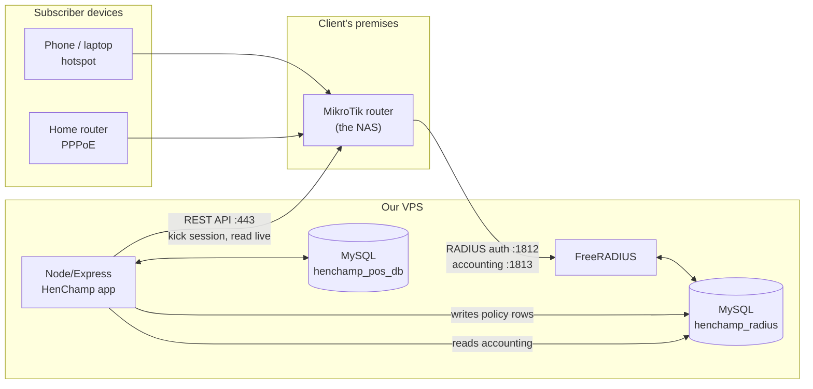

# HenChamp ISP Core — Implementation Plan (Section A)

**Owner:** Kusal (Dev 1)
**Scope:** Requirements A1–A6 from `HenChamp_Project_Requirements.pdf` (hotspot, PPPoE, MikroTik/RADIUS, voucher security, bandwidth & usage tracking)
**Status:** Planning — no ISP code exists yet
**Last updated:** 2026-08-05

> Read [ISP_LEARN.md](ISP_LEARN.md) first if RADIUS / PPPoE / hotspot are new to you. This document assumes those concepts.

---

## 0. Three findings that change the plan

Before any code, three things came out of reading the repo and the requirements doc together. Take these to the PM.

### 0.1 The requirements doc says Laravel. The repo is Node.js.

The PDF states *"Tech stack requested/confirmed: Laravel (client explicitly asked and we confirmed)."*

The actual repository is a **Node.js 22 + Express 4 + MySQL 8** application (`package.json` name: `digital-printing-pos-erp`) — an existing POS/ERP rebranded for HenChamp. There is no PHP, no Composer, no Laravel anywhere. There is not even a PHP binary on this machine.

Building Section A in Laravel would mean:

- two backends, two auth systems, two session models, two deploy pipelines
- the ISP subscriber table living in a different app from the `customers` table that Dev 3's CRM reads
- Dev 2's payment webhooks having to update state in a codebase Dev 1 doesn't own

**Recommendation: build Section A as an `isp` module inside the existing Node/Express app.** Everything below assumes that. If the PM insists on Laravel for client-facing reasons, that is a rewrite decision that must be made *now*, before anyone writes a line — not after.

### 0.2 The database connection is pinned to the wrong timezone

[`server/config/database.js:18`](../server/config/database.js#L18) sets:

```js
timezone: '+05:30' // Asia/Colombo timezone (UTC+5:30)
```

The client is in **Kenya — EAT, UTC+3**. Every billing-cycle boundary, session timestamp, voucher expiry and auto-suspend decision would be off by 2.5 hours. A voucher sold at 22:00 Nairobi time would be dated the next day.

**Fix before Phase 2:** make it configurable (`DB_TIMEZONE` in `.env`, default `+03:00`). This affects Dev 2 more than it affects me — flag it to them.

### 0.3 The effort does not match the quoted price

Section A alone is estimated below at **17–24 developer-days**. The PDF records the ISP work as discussed at **US$70**. That is not a scoping decision I can make, but the PM should see the number before committing. Section A also has a hard hardware dependency (§1.3) the client has not yet bought.

---

## 1. Architecture decisions

### 1.1 Decision: FreeRADIUS is the authority; our app is the management layer

Three options were considered for A4:

| Option | Verdict |
|---|---|
| **MikroTik User Manager** (built into RouterOS v7) | Rejected. Fine for a single café hotspot, but we cannot drive billing logic from it, customisation is limited, and it becomes the bottleneck as the client grows. The PDF explicitly says the client wants room to grow. |
| **No RADIUS** — Node app writes hotspot users / PPP secrets straight into the router over the API | Rejected as the primary design. Simple, but there is no accounting stream (so A6 usage tracking has nothing to read), no central auth if a second router is ever added, and every enforcement action becomes a bespoke API call. |
| **FreeRADIUS + MySQL (`rlm_sql`)**, with RouterOS API for imperative actions | **Chosen.** Industry standard for exactly this shape of deployment. Our app owns subscriber data and writes RADIUS policy rows; FreeRADIUS answers the router; accounting lands in `radacct` which we roll up for A6. |

So the split of responsibility is:



**Key point:** the Node app never authenticates anybody. It writes *policy* into the RADIUS database and reads *accounting* back out. FreeRADIUS does the authentication. This keeps auth off the critical path of our HTTP server — if our app is down, existing subscribers stay online.

### 1.2 Decision: two databases, one MySQL server

FreeRADIUS ships its own schema and replaces it on upgrades. Do not merge it into `henchamp_pos_db`.

- `henchamp_pos_db` — existing app tables + our new `isp_*` tables
- `henchamp_radius` — FreeRADIUS's `radcheck`, `radreply`, `radgroupcheck`, `radgroupreply`, `radusergroup`, `radacct`, `nas` (stock schema, unmodified)

Our app gets a **second connection pool** (`server/config/radius-db.js`) mirroring the style of the existing [`server/config/database.js`](../server/config/database.js). Same MySQL instance, so no distributed-transaction problem — but treat `henchamp_radius` as an integration surface, not as our own tables.

### 1.3 Decision: RouterOS **REST API**, no third-party library

The obvious npm packages are dead ends:

- `node-routeros` — **archived by its author in March 2024**, explicitly discontinued
- `routeros-client` — same author, same status
- `mikronode` — unmaintained

RouterOS v7 exposes a **JSON REST API** at `https://<router>/rest` with HTTP Basic auth. Node 22 has native `fetch`. So the whole router client is ~80 lines with **zero new dependencies** and no supply-chain risk:

```js
// GET  /rest/ppp/active            -> list live PPPoE sessions
// POST /rest/ppp/active/remove     -> kick one
// GET  /rest/ip/hotspot/active     -> list live hotspot sessions
```

Method mapping: `GET`→print, `PUT`→add, `PATCH`→set, `DELETE`→remove, `POST`→any console command. All response values are **strings**, including numbers and booleans — coerce on the way in. There is a 60-second command timeout.

Requires RouterOS **v7.1beta4 or later** and the `www-ssl` service enabled with a certificate. Plain `www` (HTTP) leaks the admin password on the wire — do not use it beyond the lab.

### 1.4 Decision: enforcement is two-layered

Suspending a subscriber has to do two different things, and juniors routinely only do the first:

1. **Stop future logins** — change policy in the RADIUS DB (move the user to a `suspended` group / set `Auth-Type := Reject`). Takes effect on next authentication.
2. **Kill the session that is already up** — the user is online *right now* and a DB row change does nothing to them.

For (2) there are two mechanisms:

| Mechanism | Notes |
|---|---|
| **RouterOS REST** `/rest/ppp/active/remove` or `/rest/ip/hotspot/active/remove` | **Chosen for v1.** Trivial from Node, no new dependency, easy to debug, returns a real error if it fails. |
| **RADIUS Disconnect-Request** (RFC 5176 / CoA) | v2. The "proper" way, and required if we ever have many NASes. Needs a RADIUS packet library — and `retailnext/node-radius` does packet encode/decode but does **not** document Disconnect/CoA support, so this is real work, not a one-liner. |

⚠️ **Gotcha for when we do get to CoA:** the RFC says UDP **3799**. MikroTik's `/radius incoming` defaults to **1700**. They must be set explicitly and match on both sides, and the firewall must allow it.

### 1.5 Decision: hardware — CHR unblocks development today

Requirement A4 says *"Client currently has no MikroTik hardware or RADIUS server — needs guidance/setup or a software-only alternative."*

**There is no software-only alternative for a real ISP.** Hotspot and PPPoE are things that happen to traffic *in the path* between the subscriber and the internet. Something has to sit there. We can build the entire management layer, but the client needs a router.

However — I am not blocked waiting for him to buy one. **MikroTik CHR (Cloud Hosted Router)** is RouterOS as a VM:

| License | Speed limit | Price |
|---|---|---|
| Free | 1 Mbps per interface | $0, runs forever |
| P1 | 1 Gbps per interface | $45 one-time |
| P10 | 10 Gbps | $95 |
| P-Unlimited | unlimited | $250 |

A 60-day free trial of any paid level is available with a mikrotik.com account. Minimum 256 MB RAM (1 GB recommended), runs on KVM/VirtualBox/VMware/Hyper-V. Docker is already installed on this machine, and libvirt/KVM is the cleaner host.

**Free CHR is enough for all of Phases 1–7.** 1 Mbps is plenty to prove auth, accounting, rate limits and disconnects work. Only load testing needs more.

For the client's production side, my recommendation to put to him: a **MikroTik hEX (RB750Gr3)** for a starter deployment, or **RB5009** if he expects the full 150 PPPoE subscribers plus hotspot. That is a hardware quote the PM needs to raise separately — it is not in the $70.

---

## 2. Data model

Matches existing house style: `snake_case`, `INT AUTO_INCREMENT` PK, `created_at` / `updated_at` timestamps, `status` ENUMs, `InnoDB`, `utf8mb4_unicode_ci`.

All new tables live in `henchamp_pos_db` and are prefixed `isp_`.

### 2.1 Tables

```sql
-- ─────────────────────────────────────────────────────────────
-- isp_packages — the tariff plans (what the client sells)
-- ─────────────────────────────────────────────────────────────
CREATE TABLE isp_packages (
  id                INT AUTO_INCREMENT PRIMARY KEY,
  code              VARCHAR(30)  NOT NULL UNIQUE,   -- HS-DAY-1, PPP-HOME-10M
  name              VARCHAR(120) NOT NULL,
  service_type      ENUM('hotspot','pppoe') NOT NULL,
  price             DECIMAL(15,2) NOT NULL DEFAULT 0.00,
  currency          CHAR(3)      NOT NULL DEFAULT 'KES',
  validity_days     INT          DEFAULT NULL,      -- PPPoE monthly = 30
  validity_minutes  INT          DEFAULT NULL,      -- hotspot time vouchers
  rate_up_kbps      INT          DEFAULT NULL,      -- client UPLOAD
  rate_down_kbps    INT          DEFAULT NULL,      -- client DOWNLOAD
  burst_up_kbps     INT          DEFAULT NULL,
  burst_down_kbps   INT          DEFAULT NULL,
  data_cap_mb       BIGINT       DEFAULT NULL,      -- NULL = uncapped
  simultaneous_use  TINYINT      NOT NULL DEFAULT 1,
  radius_group      VARCHAR(64)  NOT NULL,          -- -> radgroupreply.groupname
  status            ENUM('active','inactive') NOT NULL DEFAULT 'active',
  created_at        TIMESTAMP NULL DEFAULT CURRENT_TIMESTAMP,
  updated_at        TIMESTAMP NULL DEFAULT CURRENT_TIMESTAMP ON UPDATE CURRENT_TIMESTAMP,
  KEY idx_service_type (service_type),
  KEY idx_status (status)
) ENGINE=InnoDB DEFAULT CHARSET=utf8mb4 COLLATE=utf8mb4_unicode_ci;

-- ─────────────────────────────────────────────────────────────
-- isp_subscribers — PPPoE / account holders
-- ─────────────────────────────────────────────────────────────
CREATE TABLE isp_subscribers (
  id                  INT AUTO_INCREMENT PRIMARY KEY,
  subscriber_code     VARCHAR(30)  NOT NULL UNIQUE,  -- HC-ISP-00001
  customer_id         INT          DEFAULT NULL,     -- -> customers.id (Dev 3 CRM link)
  full_name           VARCHAR(200) NOT NULL,
  phone               VARCHAR(20)  NOT NULL,         -- MSISDN 2547XXXXXXXX (M-Pesa)
  email               VARCHAR(100) DEFAULT NULL,
  national_id         VARCHAR(30)  DEFAULT NULL,
  address             TEXT,
  service_type        ENUM('hotspot','pppoe') NOT NULL DEFAULT 'pppoe',
  radius_username     VARCHAR(64)  NOT NULL UNIQUE,
  radius_secret_enc   VARBINARY(512) NOT NULL,       -- AES-GCM; see §2.3
  package_id          INT          NOT NULL,
  status              ENUM('pending','active','grace','suspended','terminated')
                                   NOT NULL DEFAULT 'pending',
  status_reason       VARCHAR(255) DEFAULT NULL,
  billing_cycle_start DATE         DEFAULT NULL,
  billing_cycle_end   DATE         DEFAULT NULL,
  static_ip           VARCHAR(45)  DEFAULT NULL,
  installed_at        DATETIME     DEFAULT NULL,
  created_at          TIMESTAMP NULL DEFAULT CURRENT_TIMESTAMP,
  updated_at          TIMESTAMP NULL DEFAULT CURRENT_TIMESTAMP ON UPDATE CURRENT_TIMESTAMP,
  KEY idx_status (status),
  KEY idx_phone (phone),
  KEY idx_cycle_end (billing_cycle_end),
  CONSTRAINT fk_isp_sub_package  FOREIGN KEY (package_id)  REFERENCES isp_packages (id),
  CONSTRAINT fk_isp_sub_customer FOREIGN KEY (customer_id) REFERENCES customers (id) ON DELETE SET NULL
) ENGINE=InnoDB DEFAULT CHARSET=utf8mb4 COLLATE=utf8mb4_unicode_ci;

-- ─────────────────────────────────────────────────────────────
-- isp_subscriptions — billing periods. SHARED SURFACE WITH DEV 2.
-- ─────────────────────────────────────────────────────────────
CREATE TABLE isp_subscriptions (
  id            INT AUTO_INCREMENT PRIMARY KEY,
  subscriber_id INT NOT NULL,
  package_id    INT NOT NULL,
  period_start  DATE NOT NULL,
  period_end    DATE NOT NULL,
  amount        DECIMAL(15,2) NOT NULL,
  currency      CHAR(3) NOT NULL DEFAULT 'KES',
  status        ENUM('pending','paid','overdue','cancelled') NOT NULL DEFAULT 'pending',
  invoice_ref   VARCHAR(50) DEFAULT NULL,   -- Dev 2 writes
  paid_at       DATETIME    DEFAULT NULL,   -- Dev 2 writes
  created_at    TIMESTAMP NULL DEFAULT CURRENT_TIMESTAMP,
  updated_at    TIMESTAMP NULL DEFAULT CURRENT_TIMESTAMP ON UPDATE CURRENT_TIMESTAMP,
  KEY idx_subscriber (subscriber_id),
  KEY idx_status_period (status, period_end),
  CONSTRAINT fk_isp_subn_sub FOREIGN KEY (subscriber_id) REFERENCES isp_subscribers (id) ON DELETE CASCADE
) ENGINE=InnoDB DEFAULT CHARSET=utf8mb4 COLLATE=utf8mb4_unicode_ci;

-- ─────────────────────────────────────────────────────────────
-- isp_voucher_batches / isp_vouchers — hotspot (A2, A5)
-- ─────────────────────────────────────────────────────────────
CREATE TABLE isp_voucher_batches (
  id           INT AUTO_INCREMENT PRIMARY KEY,
  batch_no     VARCHAR(30) NOT NULL UNIQUE,
  package_id   INT NOT NULL,
  quantity     INT NOT NULL,
  generated_by INT DEFAULT NULL,           -- -> users.id
  notes        TEXT,
  created_at   TIMESTAMP NULL DEFAULT CURRENT_TIMESTAMP,
  CONSTRAINT fk_isp_batch_package FOREIGN KEY (package_id) REFERENCES isp_packages (id)
) ENGINE=InnoDB DEFAULT CHARSET=utf8mb4 COLLATE=utf8mb4_unicode_ci;

CREATE TABLE isp_vouchers (
  id                INT AUTO_INCREMENT PRIMARY KEY,
  batch_id          INT NOT NULL,
  code              VARCHAR(32) NOT NULL UNIQUE,  -- printed code == radius username
  secret_enc        VARBINARY(256) NOT NULL,
  package_id        INT NOT NULL,
  price             DECIMAL(15,2) NOT NULL DEFAULT 0.00,
  status            ENUM('unused','active','used','expired','revoked')
                                NOT NULL DEFAULT 'unused',
  bound_mac         VARCHAR(17) DEFAULT NULL,     -- A5: locked device
  bound_at          DATETIME    DEFAULT NULL,
  binding_resets    INT NOT NULL DEFAULT 0,
  first_used_at     DATETIME    DEFAULT NULL,
  expires_at        DATETIME    DEFAULT NULL,
  data_used_bytes   BIGINT NOT NULL DEFAULT 0,
  time_used_seconds INT    NOT NULL DEFAULT 0,
  sale_id           INT DEFAULT NULL,             -- -> sales.id (POS link)
  sold_at           DATETIME DEFAULT NULL,
  created_at        TIMESTAMP NULL DEFAULT CURRENT_TIMESTAMP,
  updated_at        TIMESTAMP NULL DEFAULT CURRENT_TIMESTAMP ON UPDATE CURRENT_TIMESTAMP,
  KEY idx_status (status),
  KEY idx_bound_mac (bound_mac),
  KEY idx_batch (batch_id),
  CONSTRAINT fk_isp_v_batch   FOREIGN KEY (batch_id)   REFERENCES isp_voucher_batches (id) ON DELETE CASCADE,
  CONSTRAINT fk_isp_v_package FOREIGN KEY (package_id) REFERENCES isp_packages (id)
) ENGINE=InnoDB DEFAULT CHARSET=utf8mb4 COLLATE=utf8mb4_unicode_ci;

-- ─────────────────────────────────────────────────────────────
-- isp_nas — routers we manage (mirrors FreeRADIUS `nas` + API creds)
-- ─────────────────────────────────────────────────────────────
CREATE TABLE isp_nas (
  id                INT AUTO_INCREMENT PRIMARY KEY,
  name              VARCHAR(120) NOT NULL,
  shortname         VARCHAR(32)  NOT NULL UNIQUE,
  nas_ip            VARCHAR(45)  NOT NULL,
  radius_secret_enc VARBINARY(512) NOT NULL,
  api_host          VARCHAR(255) NOT NULL,
  api_port          INT NOT NULL DEFAULT 443,
  api_user          VARCHAR(64)  NOT NULL,
  api_password_enc  VARBINARY(512) NOT NULL,
  api_use_tls       TINYINT NOT NULL DEFAULT 1,
  coa_port          INT NOT NULL DEFAULT 1700,    -- MikroTik default, NOT 3799
  routeros_version  VARCHAR(30) DEFAULT NULL,
  last_seen_at      DATETIME DEFAULT NULL,
  status            ENUM('active','inactive') NOT NULL DEFAULT 'active',
  created_at        TIMESTAMP NULL DEFAULT CURRENT_TIMESTAMP,
  updated_at        TIMESTAMP NULL DEFAULT CURRENT_TIMESTAMP ON UPDATE CURRENT_TIMESTAMP
) ENGINE=InnoDB DEFAULT CHARSET=utf8mb4 COLLATE=utf8mb4_unicode_ci;

-- ─────────────────────────────────────────────────────────────
-- isp_sessions — our snapshot of radacct, joined to subscriber/voucher
-- ─────────────────────────────────────────────────────────────
CREATE TABLE isp_sessions (
  id                 BIGINT AUTO_INCREMENT PRIMARY KEY,
  acct_unique_id     VARCHAR(32) NOT NULL UNIQUE,
  acct_session_id    VARCHAR(64) NOT NULL,
  username           VARCHAR(64) NOT NULL,
  subscriber_id      INT DEFAULT NULL,
  voucher_id         INT DEFAULT NULL,
  nas_id             INT DEFAULT NULL,
  nas_ip             VARCHAR(45) DEFAULT NULL,
  framed_ip          VARCHAR(45) DEFAULT NULL,
  calling_station_id VARCHAR(50) DEFAULT NULL,   -- client MAC
  called_station_id  VARCHAR(50) DEFAULT NULL,
  service_type       ENUM('hotspot','pppoe') DEFAULT NULL,
  started_at         DATETIME DEFAULT NULL,
  last_update_at     DATETIME DEFAULT NULL,
  stopped_at         DATETIME DEFAULT NULL,
  session_seconds    INT    NOT NULL DEFAULT 0,
  input_octets       BIGINT NOT NULL DEFAULT 0,  -- upload  (gigawords already folded in)
  output_octets      BIGINT NOT NULL DEFAULT 0,  -- download
  terminate_cause    VARCHAR(32) DEFAULT NULL,
  KEY idx_username (username),
  KEY idx_subscriber (subscriber_id),
  KEY idx_started (started_at),
  KEY idx_open (stopped_at)
) ENGINE=InnoDB DEFAULT CHARSET=utf8mb4 COLLATE=utf8mb4_unicode_ci;

-- ─────────────────────────────────────────────────────────────
-- isp_usage_daily — rollup so the dashboard never scans radacct (A6)
-- ─────────────────────────────────────────────────────────────
CREATE TABLE isp_usage_daily (
  id              BIGINT AUTO_INCREMENT PRIMARY KEY,
  subscriber_id   INT DEFAULT NULL,
  voucher_id      INT DEFAULT NULL,
  usage_date      DATE NOT NULL,
  upload_bytes    BIGINT NOT NULL DEFAULT 0,
  download_bytes  BIGINT NOT NULL DEFAULT 0,
  session_seconds INT    NOT NULL DEFAULT 0,
  updated_at      TIMESTAMP NULL DEFAULT CURRENT_TIMESTAMP ON UPDATE CURRENT_TIMESTAMP,
  UNIQUE KEY uq_sub_date (subscriber_id, usage_date),
  UNIQUE KEY uq_vou_date (voucher_id, usage_date),
  KEY idx_date (usage_date)
) ENGINE=InnoDB DEFAULT CHARSET=utf8mb4 COLLATE=utf8mb4_unicode_ci;

-- ─────────────────────────────────────────────────────────────
-- isp_audit_log — who suspended whom, when, why
-- ─────────────────────────────────────────────────────────────
CREATE TABLE isp_audit_log (
  id            BIGINT AUTO_INCREMENT PRIMARY KEY,
  entity_type   VARCHAR(40) NOT NULL,   -- subscriber | voucher | nas | package
  entity_id     INT NOT NULL,
  action        VARCHAR(60) NOT NULL,   -- suspend | restore | bind_mac | reset_binding ...
  actor_user_id INT DEFAULT NULL,       -- NULL = system/cron
  detail        JSON DEFAULT NULL,
  created_at    TIMESTAMP NULL DEFAULT CURRENT_TIMESTAMP,
  KEY idx_entity (entity_type, entity_id),
  KEY idx_created (created_at)
) ENGINE=InnoDB DEFAULT CHARSET=utf8mb4 COLLATE=utf8mb4_unicode_ci;
```

### 2.2 How our tables map onto FreeRADIUS tables

We never let a human edit the RADIUS tables. Our provisioning service is the only writer.

| Our concept | FreeRADIUS row we write |
|---|---|
| Subscriber credentials | `radcheck (username, 'Cleartext-Password', ':=', <secret>)` |
| Subscriber → package | `radusergroup (username, <package.radius_group>, 1)` |
| Package speed | `radgroupreply (group, 'Mikrotik-Rate-Limit', ':=', '1M/10M')` |
| Package concurrency | `radgroupcheck (group, 'Simultaneous-Use', ':=', '1')` |
| Package data cap ≤ 4 GiB | `radgroupreply (group, 'Mikrotik-Total-Limit', ':=', <bytes>)` |
| Package data cap > 4 GiB | **also** `Mikrotik-Total-Limit-Gigawords` — see §2.4 |
| Voucher device lock (A5) | `radcheck (code, 'Calling-Station-Id', '==', <mac>)` |
| Suspension | move to `suspended` group + `radcheck (username, 'Auth-Type', ':=', 'Reject')` |
| Router registration | `nas (nasname, shortname, type='mikrotik', secret)` |

### 2.3 ⚠️ RADIUS needs the password in cleartext — plan for it

This trips up everyone coming from web auth. CHAP, MS-CHAP and MS-CHAPv2 require the server to hold the **original password**, because the client sends a hash of `challenge + password` and the server must recompute it. You cannot bcrypt it like `users.password_hash`.

Three ways out, in order of preference:

1. **Force PAP only** on the hotspot/PPPoE profile, and store a bcrypt hash. Safest, but PAP sends the password in the RADIUS packet protected only by the shared secret's weak obfuscation. Acceptable only when FreeRADIUS and the NAS talk over a private link or VPN.
2. **Store `Cleartext-Password`, encrypted at rest in our table** (`radius_secret_enc`, AES-256-GCM with a key from `.env`), decrypting only when writing the RADIUS row. This is what the schema above does. FreeRADIUS's `radcheck` still holds cleartext — so lock that DB user down to localhost and give it no access to `henchamp_pos_db`.
3. Use auto-generated random secrets (not user-chosen passwords) so a leak does not expose credentials reused elsewhere. **Do this regardless** — subscribers never pick their own PPPoE password.

Decision for v1: **option 2 + option 3.** Document it honestly in the handover; it is a standard ISP tradeoff, not a shortcut.

### 2.4 ⚠️ The 4 GiB counter bug

`Mikrotik-Total-Limit` (attr 17) and the standard `Acct-Input-Octets` / `Acct-Output-Octets` are **32-bit unsigned** → they wrap at 4,294,967,295 bytes (~4 GiB).

RADIUS solves this with companion "gigawords" attributes holding the high-order 32 bits:

```
real_bytes = (gigawords × 2^32) + octets
```

- `Acct-Input-Gigawords` (52) / `Acct-Output-Gigawords` (53)
- `Mikrotik-Total-Limit-Gigawords` (18), `Mikrotik-Recv-Limit-Gigawords` (14), `Mikrotik-Xmit-Limit-Gigawords` (15)

FreeRADIUS's stock SQL queries already fold these into `radacct.acctinputoctets` (a `bigint`). **But the moment I write my own accounting reader or set a data cap above 4 GiB, I have to handle gigawords myself.** Every usage figure must be unit-tested against a >4 GiB case. Without this, a subscriber on a 20 GB plan shows 1.2 GB used and never gets capped.

---

## 3. Code layout

```
server/
  config/
    radius-db.js                 NEW  second pool -> henchamp_radius
  services/                      NEW  dir (repo currently has none — justified below)
    isp/
      routeros.service.js        NEW  REST client for MikroTik (native fetch)
      radius.service.js          NEW  read/write radcheck|radreply|radusergroup|nas
      provisioning.service.js    NEW  subscriber/voucher -> RADIUS rows
      lifecycle.service.js       NEW  activate/suspend/restore  ← DEV 2 CALLS THIS
      voucher.service.js         NEW  generate, bind MAC, revoke
      accounting.service.js      NEW  radacct -> isp_sessions -> isp_usage_daily
      crypto.js                  NEW  AES-256-GCM helpers for *_enc columns
  controllers/
    isp-package.controller.js    NEW
    isp-subscriber.controller.js NEW
    isp-voucher.controller.js    NEW
    isp-session.controller.js    NEW
    isp-nas.controller.js        NEW
  routes/
    isp.routes.js                NEW  mounts the five controllers under /api/isp
  jobs/                          NEW  dir
    isp-accounting.job.js        NEW  poll radacct, roll up usage
    isp-session-reaper.job.js    NEW  close zombie sessions (§5.4)
  server.js                      EDIT +2 lines: import + app.use('/api/isp', ispRoutes)

database/
  migrations/isp/
    001_isp_core.sql             NEW  packages, subscribers, subscriptions
    002_isp_vouchers.sql         NEW
    003_isp_nas_sessions.sql     NEW
    004_isp_usage_audit.sql      NEW
  freeradius/
    schema.sql                   NEW  stock FreeRADIUS schema (vendored, unmodified)
    henchamp-sql.conf            NEW  our rlm_sql config
    dictionary.mikrotik          NEW  vendored, vendor 14988

public/
  js/pages/isp-subscribers.js    NEW
  js/pages/isp-vouchers.js       NEW
  js/pages/isp-sessions.js       NEW
  pages/isp-*.html               NEW
  js/frame.js                    EDIT add "ISP" nav section
  js/app-shell.js                EDIT add router.addRoute('/isp/...')

tests/
  isp-gigawords.test.js          NEW  the >4 GiB case
  isp-voucher-binding.test.js    NEW
  isp-rate-limit-format.test.js  NEW
```

**On adding `server/services/`:** the repo currently has controllers do everything, and normally I'd match that. I'm deviating deliberately and narrowly: this subsystem does network I/O to two external systems (a router, a RADIUS DB). Keeping that behind services is what makes it testable without a live router — I can mock `routeros.service.js` in Jest. Controllers stay thin and look exactly like [`quotation.controller.js`](../server/controllers/quotation.controller.js). This is worth raising at the Phase 0 sync so the team agrees.

### 3.1 API surface

All routes behind `verifyToken` + `checkPermission`, matching [`quotation.routes.js`](../server/routes/quotation.routes.js).

| Method | Path | Permission |
|---|---|---|
| GET/POST/PUT/DELETE | `/api/isp/packages` | `isp:packages:*` |
| GET/POST/PUT | `/api/isp/subscribers` | `isp:subscribers:*` |
| POST | `/api/isp/subscribers/:id/suspend` | `isp:subscribers:suspend` |
| POST | `/api/isp/subscribers/:id/restore` | `isp:subscribers:suspend` |
| POST | `/api/isp/subscribers/:id/disconnect` | `isp:subscribers:suspend` |
| GET | `/api/isp/subscribers/:id/usage` | `isp:read` |
| POST | `/api/isp/vouchers/generate` | `isp:vouchers:create` |
| GET | `/api/isp/vouchers` · `/batches/:id` | `isp:read` |
| POST | `/api/isp/vouchers/:id/revoke` | `isp:vouchers:manage` |
| POST | `/api/isp/vouchers/:id/reset-binding` | `isp:vouchers:manage` |
| GET | `/api/isp/sessions/live` | `isp:read` |
| DELETE | `/api/isp/sessions/:acctUniqueId` | `isp:subscribers:suspend` |
| GET/POST/PUT | `/api/isp/nas` · `POST /:id/test` | `isp:nas:manage` |

New permissions must be seeded into `role_permissions` (see [`scripts/grant_admin_all_permissions.js`](../scripts/grant_admin_all_permissions.js) for the pattern).

---

## 4. The contract with Dev 2 — agree this in Phase 0

The requirements doc is explicit: *"recommend Dev 1 and Dev 2 agree on a shared subscriber/payment-status data model before either starts building."* This is the single highest-risk coordination point in the project.

It's one monolith, so **no event bus, no queue, no internal HTTP.** Direct module imports.

**What I provide (Dev 2 imports this):**

```js
// server/services/isp/lifecycle.service.js

/** Turn service on. Writes RADIUS policy, sets status='active', extends cycle. */
export async function activateSubscriber(subscriberId, { periodStart, periodEnd, reason });

/** Turn service off. Rejects future auth AND kicks any live session. */
export async function suspendSubscriber(subscriberId, { reason, disconnectNow = true });

/** Reverse a suspension. Idempotent — safe to call on an already-active subscriber. */
export async function restoreSubscriber(subscriberId, { reason });

/** Soft state: still online, but flagged and notified. */
export async function setGrace(subscriberId, { until, reason });

/** For Dev 2's nightly billing cron. */
export async function getBillableSubscribers({ dueBefore });
```

**What I need from Dev 2:**

- On a confirmed Daraja/Paystack payment that clears the outstanding balance → call `restoreSubscriber()`.
- On cycle end with no payment after grace → call `suspendSubscriber()`.
- Dev 2 owns `isp_subscriptions.status`, `.invoice_ref`, `.paid_at`. I own everything else in that table and I do not write those three columns.

**Shared status vocabulary — nobody invents new values:**

| Status | Meaning | Can go online? |
|---|---|---|
| `pending` | created, never activated | ✗ |
| `active` | paid and in service | ✓ |
| `grace` | overdue, temporarily still on | ✓ (often rate-limited) |
| `suspended` | non-payment, cut off | ✗ |
| `terminated` | closed permanently | ✗ |

**Idempotency is on me.** Daraja retries webhooks. `restoreSubscriber()` will be called two or three times for one payment. Every function above must be safe to call repeatedly — check current state first, no-op if already there, and never double-extend a billing cycle.

---

## 5. Phased delivery

### Phase 0 — Contract & foundations (1–2 days)

- [ ] Take findings §0.1 (Laravel vs Node) and §0.3 (effort vs price) to the PM. **Blocking.**
- [ ] Sync with Dev 2: agree §4 verbatim. Write it into `docs/ISP_MEMORY.md` once signed off.
- [ ] Sync with Dev 3: confirm `isp_subscribers.customer_id → customers.id` is how the CRM sees ISP customers.
- [ ] Fix the timezone (`DB_TIMEZONE`, default `+03:00`).
- [ ] Add ISP env vars to `.env.example`.

**Done when:** Dev 2 has the function signatures and the status enum, and nobody is guessing.

### Phase 1 — Lab, by hand, no code (1–2 days)

Prove I can do everything manually before automating any of it. **Do not skip this** — debugging a Node service against a router you don't understand is miserable.

- [ ] Install CHR (free licence) in KVM or VirtualBox.
- [ ] Give it two interfaces: WAN (NAT to host) + LAN (internal network).
- [ ] Configure a hotspot on the LAN bridge; log in with the local user DB.
- [ ] Configure a PPPoE server; connect with a second VM as the client.
- [ ] Install FreeRADIUS 3.x + `freeradius-mysql`; import the stock schema into `henchamp_radius`.
- [ ] Register CHR in the `nas` table; point `/radius` on CHR at FreeRADIUS.
- [ ] Move both hotspot and PPPoE to `use-radius=yes`; authenticate a user that exists **only** in `radcheck`.
- [ ] Confirm rows appear in `radacct` — start, interim-update and stop.
- [ ] Apply `Mikrotik-Rate-Limit` via `radgroupreply` and **verify empirically which direction is which** (see §6).
- [ ] Kick a live session via `curl` against `/rest/ppp/active/remove`.

**Done when:** I can narrate every packet in the login of a user I created with an `INSERT`.

### Phase 2 — Packages & subscribers (3–4 days)

- [ ] Migrations `001_isp_core.sql`.
- [ ] `crypto.js` (AES-256-GCM), `radius-db.js` (second pool).
- [ ] `radius.service.js` — typed read/write of the five RADIUS tables.
- [ ] `provisioning.service.js` — subscriber → `radcheck` + `radusergroup`; package → `radgroupreply` + `radgroupcheck`. **Transactional and idempotent:** re-provisioning must converge, not duplicate.
- [ ] Package + subscriber controllers and routes; seed permissions.

**Done when:** creating a subscriber in the UI lets that person authenticate on the CHR, with no manual SQL.

### Phase 3 — Vouchers & single-device lock (3–4 days) ← *the client's explicit A5 ask*

- [ ] Migrations `002_isp_vouchers.sql`.
- [ ] Batch generation: N codes, `crypto.randomBytes`, unambiguous alphabet (**no `0/O`, `1/I/l`** — these get printed and typed by hand), collision retry.
- [ ] Provision each voucher into `radcheck` with the package group.
- [ ] `Simultaneous-Use := 1` on every voucher group.
- [ ] **MAC binding:** a poller reads `radacct` for sessions whose voucher has `bound_mac IS NULL`, writes `calling_station_id` to both `isp_vouchers.bound_mac` **and** `radcheck (code, 'Calling-Station-Id', '==', mac)`.
- [ ] Admin "reset binding" action (increments `binding_resets`, writes `isp_audit_log`).
- [ ] Printable voucher sheet — reuse `pdfkit`, already a dependency.
- [ ] Expiry job: `first_used_at + validity` → `status='expired'` + deprovision.

I'm doing the binding in **our Node poller**, not the cron/bash/MySQL-trigger hacks the MikroTik blogs use, because it is testable and lives in one language.

⚠️ **Tell the client this honestly, and put it in writing:**

- **MAC addresses are trivially spoofable.** This stops casual code-sharing between friends. It is not a cryptographic guarantee, and no vendor's implementation is.
- **Modern phones randomise their MAC per SSID** (iOS "Private Wi-Fi Address", Android "Randomized MAC"). It is usually stable *for that SSID*, so binding works — but if the user toggles the setting or forgets the network, they get locked out of their own voucher. This is exactly why the "reset binding" button exists, and the client's counter staff need to know about it.

**Done when:** voucher X works on phone A, is refused on phone B, and an admin can free it.

### Phase 4 — Bandwidth & usage (2–3 days) — A6

- [ ] `Mikrotik-Rate-Limit` built from package columns, correct format and direction.
- [ ] Data caps with **gigawords handled** (§2.4).
- [ ] `accounting.service.js`: `radacct` → `isp_sessions` (incremental by `radacctid` watermark, never a full scan).
- [ ] Nightly rollup → `isp_usage_daily`.
- [ ] `isp-accounting.job.js` on an interval; use the existing [`task-queue.js`](../server/utils/task-queue.js).
- [ ] Endpoints: per-subscriber usage, top-N talkers, live sessions.

**Done when:** a subscriber who has moved 6 GB reads **6 GB**, not 1.7 GB. That single test is the whole point of this phase.

### Phase 5 — Enforcement & Dev 2 handoff (2–3 days) — unblocks B1/B2

- [ ] `lifecycle.service.js` — the four functions in §4, each idempotent.
- [ ] Suspend = RADIUS policy change **+** live-session kick over REST.
- [ ] Restore = reverse both, verify the user can immediately re-auth.
- [ ] Every transition writes `isp_audit_log`.
- [ ] Session reaper for zombie sessions (§5.4 below).
- [ ] Pair with Dev 2 and run it end-to-end against a sandbox payment.

**Done when:** Dev 2 calls `restoreSubscriber()` three times for one payment and the result is identical to calling it once.

### Phase 6 — Admin UI (3–4 days)

A7 is nominally Dev 2's ticket, but every number on it comes from my tables, so I build the data endpoints and probably the pages too. Confirm ownership at the Phase 0 sync.

- [ ] Nav section in `frame.js`, routes in `app-shell.js` (follow the existing `addRoute` pattern).
- [ ] Subscribers list — status, package, cycle end, live/offline.
- [ ] Live sessions — IP, MAC, uptime, throughput, kick button.
- [ ] Voucher batches — generate, print, revoke, binding state.
- [ ] Usage charts.

### Phase 7 — Hardening & handover (2 days)

- [ ] Jest tests for gigawords, rate-limit string building, voucher binding, idempotency.
- [ ] Router unreachable → queue the action and retry, never lose a suspend.
- [ ] Rate-limit and audit the destructive endpoints.
- [ ] Runbook: how the client's staff sell a voucher, reset a binding, read the dashboard.

**Total: 17–24 developer-days for Section A.**

### 5.4 ⚠️ Zombie sessions will bite

`Simultaneous-Use := 1` works by counting open rows in `radacct` (rows with `acctstoptime IS NULL`). If the router reboots or a packet is lost, the `Acct-Stop` never arrives and the row stays open forever. The subscriber is then **locked out of their own account** by a session that no longer exists — and the support call lands on us.

Mitigations, all three:

1. Set `Acct-Interim-Interval` (5–10 min) so stale rows are detectable by age.
2. `isp-session-reaper.job.js`: close sessions with no interim update in 3× the interval.
3. On CHR reboot, FreeRADIUS's `Accounting-On`/`Accounting-Off` handling should bulk-close that NAS's sessions.

---

## 6. Verify-on-the-box list

Things the docs state but that I will confirm empirically in Phase 1 rather than trust:

1. **`Mikrotik-Rate-Limit` direction.** Documented as `rx-rate/tx-rate`, where from the router's perspective *rx = received from client = the client's upload* and *tx = the client's download*. So `1M/10M` should mean 1 Mbps up, 10 Mbps down. Getting this backwards ships every customer an inverted plan — run a real speed test before writing the package builder.
2. **CHR free licence = 1 Mbps/interface**, which will cap the speed test itself. Test *relative* shaping (set 512k, confirm it's slower than unshaped) rather than absolute numbers.
3. **`/radius incoming` port** — 1700 on MikroTik, 3799 in the RFC.
4. **REST values are strings.** `"disabled": "false"` is a truthy string. Coerce explicitly.
5. **Hotspot vs PPPoE `Calling-Station-Id`** — confirm both carry the client MAC in the format I expect (case, separator) before binding on it. Normalise to uppercase-colon.

---

## 7. Open questions for the client (my section only)

Feed these into §6 of the requirements doc:

1. **Is he buying a MikroTik router, and who specs it?** Nothing ships without one. Recommend hEX RB750Gr3 (starter) or RB5009 (full 150 subs). Needs its own quote.
2. **Where does FreeRADIUS live?** Same VPS as the app, or separate? If the router is on a home/office connection with a dynamic IP, we need a VPN or a static IP for RADIUS to reach it.
3. **Hotspot topology** — one location or several? Multi-site changes NAS management from "a row" to "a feature".
4. **Does he already have public IPs / an upstream provider?** PPPoE needs an address pool. Behind CGNAT, port-forwarding and CoA get painful.
5. **Voucher denominations** — time-based (1 hr / 1 day / 1 week), data-based (500 MB / 2 GB), or both? Decides whether `validity_minutes` or `data_cap_mb` is the primary column.
6. **Does he accept the MAC-binding caveats in Phase 3?** Get it in writing — it is the requirement he was most explicit about, and it has real-world edges.

---

## 8. Sources

- [RouterOS REST API](https://help.mikrotik.com/docs/spaces/ROS/pages/47579162/REST+API) · [RouterOS RADIUS](https://help.mikrotik.com/docs/spaces/ROS/pages/328097/RADIUS) · [Cloud Hosted Router (CHR)](https://help.mikrotik.com/docs/spaces/ROS/pages/18350234/Cloud+Hosted+Router+CHR) · [Hotspot captive portal](https://help.mikrotik.com/docs/spaces/ROS/pages/56459266/HotSpot+-+Captive+portal)
- [FreeRADIUS MySQL schema](https://github.com/FreeRADIUS/freeradius-server/blob/master/raddb/mods-config/sql/main/mysql/schema.sql) · [MikroTik dictionary (vendor 14988)](https://github.com/FreeRADIUS/freeradius-server/blob/master/share/dictionary/radius/dictionary.mikrotik) · [rlm_sql](https://wiki.freeradius.org/modules/Rlm_sql) · [Disconnect Messages](https://wiki.freeradius.org/protocol/Disconnect-Messages)
- [RFC 5176 — Dynamic Authorization Extensions to RADIUS](https://www.rfc-editor.org/rfc/rfc5176.html)
- [node-routeros (archived Mar 2024)](https://github.com/aluisiora/node-routeros) · [retailnext/node-radius](https://github.com/retailnext/node-radius)
- [Auto MAC binding on first login — FreeRADIUS + MikroTik](https://aacable.wordpress.com/2017/10/31/mikrotik-with-freeradiusmysql-auto-mac-binding-on-1st-login-part-4/)
